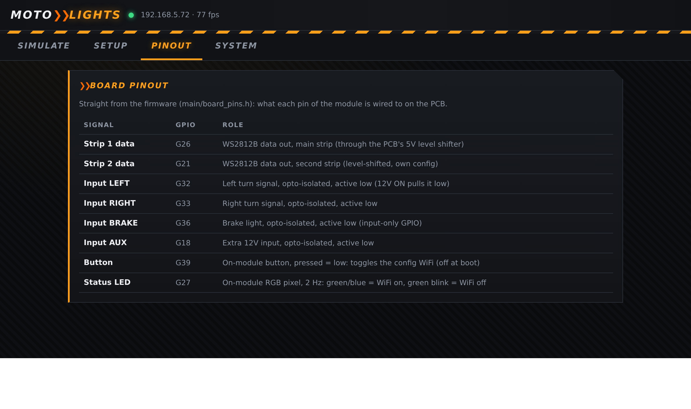
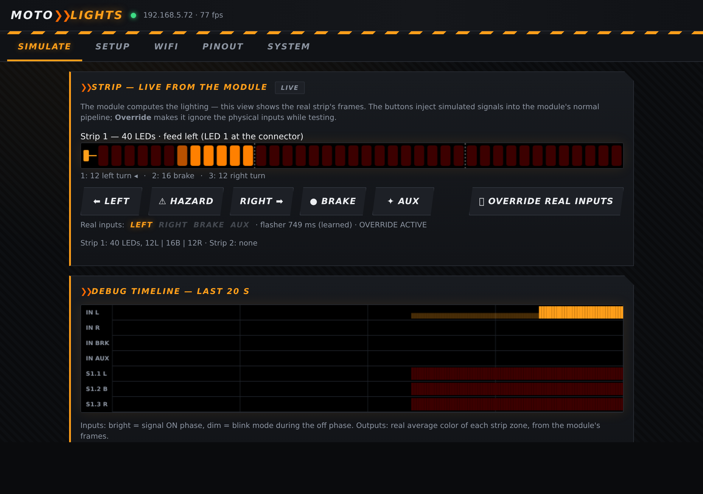
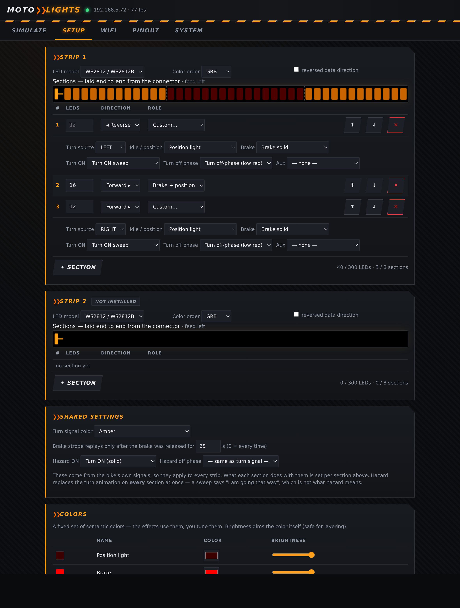
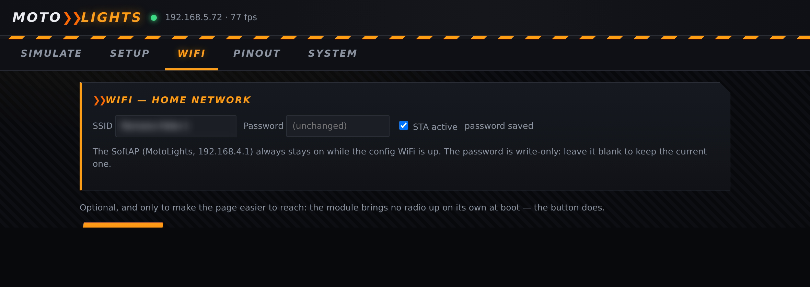
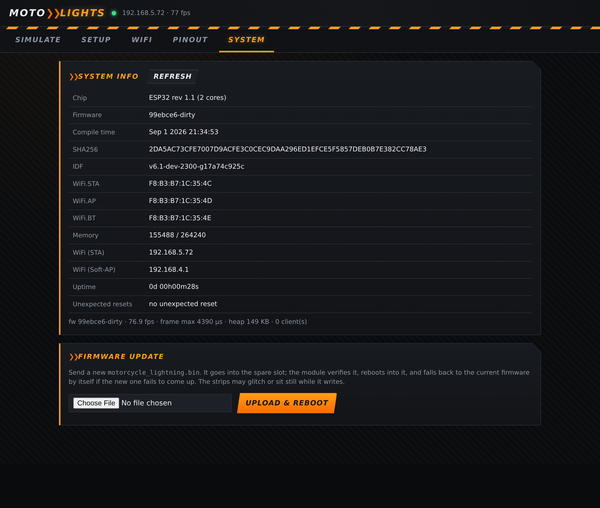

# MotoLights — user manual

Auxiliary turn signals and brake light for a motorcycle top box, driven from
the bike's own 12 V lighting signals.

The module reads LEFT, RIGHT, BRAKE and an AUX input through optocouplers and
drives up to two WS2812B-family strips. It learns your flasher's rhythm, so
the animations run in step with the bike instead of guessing. A configuration
page lets you describe the strip and see exactly what it is doing, live.

> **This is supplementary lighting.** Your motorcycle keeps its own legal
> lamps and they remain the ones that matter. The module is built to fail
> **dark** rather than wrong: a strip that shows nothing misleads nobody, a
> strip that shows the wrong signal does. Never rely on it as your only turn
> signal or brake light.

---

## 1. Wiring

Each input is opto-isolated and **active low**: applying 12 V to it turns the
signal ON. The strips need 5 V; the board level-shifts the data lines.

The Pinout tab of the config page always shows the pin map of the firmware
you are actually running, so check it there rather than trusting a printout.

**Which end of the strip?** LED 1 is the end where the data connector is. If
your bar is mounted with the connector on the right, say so in Setup
(*reversed data direction*) and everything — animations, previews, the live
view — follows.

---

## 2. First power-up

The status LED on the module tells you where you are:

| Status LED | Meaning |
|---|---|
| solid blue | booting |
| green blink, 2 Hz | running normally, config WiFi **off** |
| green / blue alternating, 2 Hz | running, config WiFi **on** |
| purple blink | running on factory defaults — the stored config was rejected |
| solid fuchsia | the button was held 15 s: everything is being erased |
| orange blink | network error |

**The config WiFi is off at boot, on purpose.** Riding needs no radio, and a
module that does not transmit uses less power and has less to go wrong. Press
the module button once to bring it up; press again to shut it down.

---

## 3. Getting to the page

1. Press the module button — the status LED starts alternating green/blue.
2. Join the WiFi network **MotoLights** from your phone or laptop.
3. Open **http://192.168.4.1**.

If you gave the module your home network in the **WiFi** tab, it also joins
that network when the config WiFi is up, and the page is reachable at the
address shown in the System tab. The SoftAP always stays available either way, so you can
never lock yourself out.

The page has five tabs. Everything you change lives in **Setup** and
**WiFi**, and is only applied when you press **Save** — the button grows a
dot when you have unsaved changes, and leaving asks first.

---

## 4. Simulate — see what the module is doing

The strip drawing is not a mock-up: it is the module's real frames, pushed
to the page about 30 times a second (the LEDs themselves refresh at ~75).
What you see here is exactly what the LEDs show.

- **LEFT / HAZARD / RIGHT / BRAKE / AUX** inject a simulated signal into the
  module's normal pipeline — the lighting logic is the same one used on the
  road, never a copy running in your browser.
- **Override real inputs** makes the module ignore the physical inputs while
  you test on the bench. It expires by itself after 60 seconds, so a
  simulation can never follow you onto the road.
- **Real inputs** shows the physical state of the four inputs, with the
  learned flasher period next to it.
- The **debug timeline** keeps the last 20 seconds: the four inputs on top,
  then one lane per section showing its real average colour.

---

## 5. Setup — describing your strip

### Sections

A strip is an ordered list of up to **8 sections**, laid end to end starting
at the connector. Each section has its own length, direction and role, and
the strip's total is simply their sum (300 LEDs maximum).

For each section:

| Column | What it does |
|---|---|
| **LEDs** | how many pixels this section covers |
| **Direction** | which way its animations run — *Reverse* flips them |
| **Role** | a preset, or **Custom…** to set each event yourself |

**Roles** are shortcuts that fill in the effects below:

- **Turn left** / **Turn right** — position light, brake, and the turn
  animation driven by that side's signal
- **Brake + position** — no blinker, lights up on the brake
- **Position only** — always on, ignores brake and turn
- **Custom…** — opens the selectors: *Turn source*, then one effect each
  for *Idle / position*, *Brake*, *Turn ON*, *Turn off phase* and *Aux*

Any event can be set to **— none —**, which means "paint nothing here" — the
layers below stay visible. That is not the same as the *Off (dark)* effect,
which actively paints the section black. Both are honoured on the brake: a
section that asks for *Off* stays dark while you brake, and one that asks for
nothing keeps showing its position light. Only a section with a real brake
effect gets the red safety floor.

Use **↑ ↓** to reorder sections — the order *is* the wiring order — and
**✕** to delete one. Rows alternate shading, and the preview above shades
every other section, so two neighbouring sections of the same role stay
apart.

### Effects available

| Effect | What it looks like |
|---|---|
| Position light | steady dim red |
| Brake solid | full red |
| Brake 3× flash | three quick flashes, then solid |
| Turn ON (solid) | the whole section in the turn colour |
| Turn ON sweep | the turn colour sweeps across the section |
| Turn off-phase (low red) | what a blinking section shows between flashes |
| Full white | steady white |
| Off (dark) | paints black |

### Strip hardware

**LED model** (WS2812/WS2812B, SK6812, WS2811, WS2816) and **colour order**
(GRB, RGB, GRBW, RGBW) are per strip — one physical controller, one LED type.
If your colours come out swapped (red showing as green), the colour order is
what to change.

### Shared settings

These come from the bike itself, so they apply to every strip:

- **Turn signal colour** — amber, red, or a custom colour from the palette
- **Brake strobe holdoff** — the brake's flash intro only replays if the
  brake was released for at least this long, so stop-and-go traffic does not
  turn into a strobe show. `0` replays every time.
- **Hazard ON** / **Hazard off phase** — what every section plays while
  *both* signals blink. Leave them on *same as turn signal* and hazard looks
  like two turn signals at once; set the flash to **Turn ON (solid)** and the
  sweep stays for real turns only. A sweep says "I am going that way", which
  is not what hazard means.

### Colours

Four semantic colours — position, brake, turn signal, white — that the
effects refer to. Editing one changes every effect that uses it. The
brightness slider dims the colour itself, and it is the **only** brightness
control: there is no separate per-strip level to fight with.

### Save / Export / Import / Restore defaults

**Save** writes everything to the module's flash and applies it immediately.

**Export** downloads the whole configuration as a JSON file — a backup before
you experiment, or a way to put the same setup on a second module. Passwords
are never in the file. **Import** loads one back into the page; nothing
reaches the module until you press **Save**, so you can look it over first.

**Restore defaults** puts back the factory layout (a 40-LED bar: 12 left turn,
16 brake, 12 right turn) and clears your settings, including the WiFi ones.

---

## 6. WiFi — the module's network and yours

### The module's access point

This is the network you join to reach this page. Leave the SSID blank and it
stays the factory one — **MotoLights**, password **motolights**. Name it
yourself and it needs a password of at least eight characters; the module
refuses anything shorter, because an access point that fails to start is an
access point you cannot reach. The change takes effect the next time the
config WiFi comes up.

**Locked yourself out?** Hold the module button for 15 seconds. The status LED
turns fuchsia for a second, and the module erases everything it remembers —
configuration, access point, learned flasher period — and comes back on
factory settings.

### Your home network

Optional, and only there to make the page easier to reach from a laptop:
enter your network's SSID and password and the module joins it whenever the
config WiFi is up. The SoftAP stays available at the same time, so a wrong
password here can never lock you out.

The password is write-only — the field shows *(unchanged)* and leaving it
blank keeps the one already stored. **STA active** is what decides whether
the module tries to join at all. None of this makes the module transmit on
its own: the radio still only comes up when you press the button.

*(The SSID is blurred in this screenshot, not on your page.)*

---

## 7. System — what the module reports

Firmware build, chip, addresses, uptime, free memory — and **Unexpected
resets**, which is the one worth a glance. The module keeps the last 8
resets it did not ask for (a crash or a watchdog reboot) in flash. Losing
power is not a crash and is never counted, so anything other than *no
unexpected reset* here is worth reporting.

---

## 8. Updating the firmware

The System tab takes a new `motorcycle_lightning.bin` and installs it over
WiFi — no cable, no opening the box.

1. Bring the config WiFi up and open the page.
2. **System → Firmware update**, choose the `.bin`, press **Upload & reboot**.
3. Watch the bar; roughly 900 KB takes a few seconds. The module verifies the
   image, reboots into it, and the page reloads by itself.

The flash holds **two** firmware slots. An update is written to the spare one,
so the firmware you are running is never overwritten while it runs. The new
one has to prove itself: if it fails to complete a boot — a crash, a watchdog
reset — the module goes back to the previous slot on its own. An image built
for another project is refused before a single byte is written.

The strips may glitch or sit still while the flash is being written; that is
expected, and the module reboots dark either way. Note that the config WiFi is
off again after the reboot, as after any restart — press the button to get the
page back.

---

## 9. How it behaves on the road

**Turn signals.** The module measures your flasher's period the first time it
sees it blink and remembers it across reboots. A sweep is scaled to that
period, so it always finishes in exactly one flash whatever the rate. When
the signal stops, the module waits 20 % longer than the learned period before
leaving blink mode — it never cuts a flash short.

**Hazards.** With both signals blinking, both sides lock to the one that
started first, so the two ends of the bar — and both strips — stay in step
instead of drifting apart. If you gave hazard its own effect in Setup, it
replaces what every section would otherwise play, on both sides at once.

**Braking.** While the brake input is on, every section that has a brake
effect gets a red floor, so it can never be darker than a visible red. A
section that is currently blinking skips its brake layer entirely: a turn
signal outranks the brake light on that piece of strip, which is what a
driver behind you needs to see.

**Failures.** The strips are latched black in the first milliseconds of boot,
before anything else runs. If the lighting task ever stops, a watchdog reboots
the module — and it comes back dark rather than frozen on half a frame.

---

## 10. Troubleshooting

| Symptom | What it means |
|---|---|
| Strip completely dark, module otherwise alive | no section defined for that strip, or a wiring problem — check the Setup total (`0 / 300 LEDs`) |
| Purple blinking status LED | the stored configuration was rejected and factory defaults are running — open Setup, check it, and Save |
| Page unreachable | config WiFi is off — press the module button; the LED must alternate green/blue |
| Access point name or password forgotten | hold the button 15 s: fuchsia LED, then factory settings and the **MotoLights** network is back |
| Colours wrong (red shows green) | wrong **colour order** for your strip |
| Animation runs the wrong way | flip the section's **Direction**, or the strip's **reversed data direction** if the whole bar is mirrored |
| Blinking out of step with the bike | let it blink a few times so the period gets learned; the Simulate tab shows the learned value next to the real inputs |
| `Unexpected resets` is not zero | the module crashed or was rebooted by its watchdog — note the reason and report it |
| Firmware update refused | the file is not a MotoLights image, or it is not an ESP32 application at all — the message says which |
| The module came back on the old firmware after an update | the new image failed its first boot and the module rolled itself back |

A serial console is available at 115200 baud with a few commands: `wifi`,
`wifi on`, `wifi off`, `crashlog`, `crashlog clear`, `reboot`.

---

## 11. Limits

| | |
|---|---|
| Strips | 2 independent outputs |
| Sections per strip | 8 |
| LEDs per strip | 300 |
| Frame rate | ~75 Hz, refreshed continuously |
| LED families | WS2812/WS2812B, SK6812, WS2811, WS2816 |
| Inputs | LEFT, RIGHT, BRAKE, AUX — 12 V, opto-isolated, active low |

